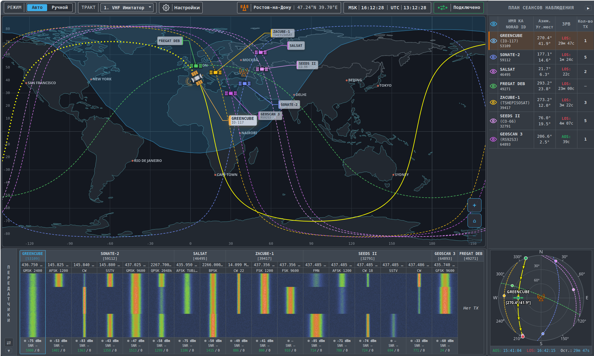
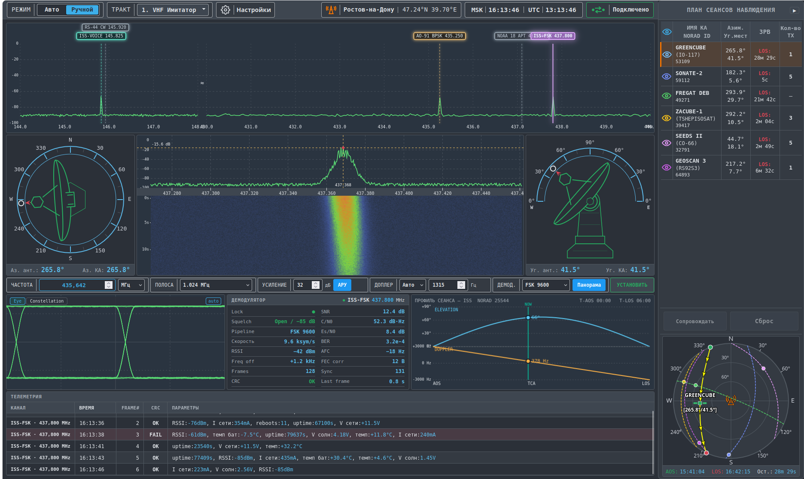
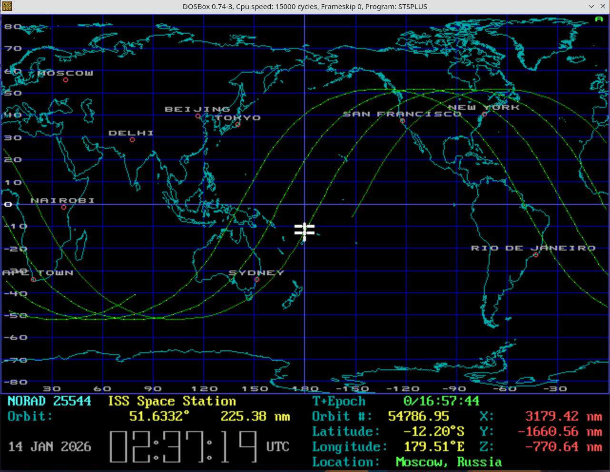
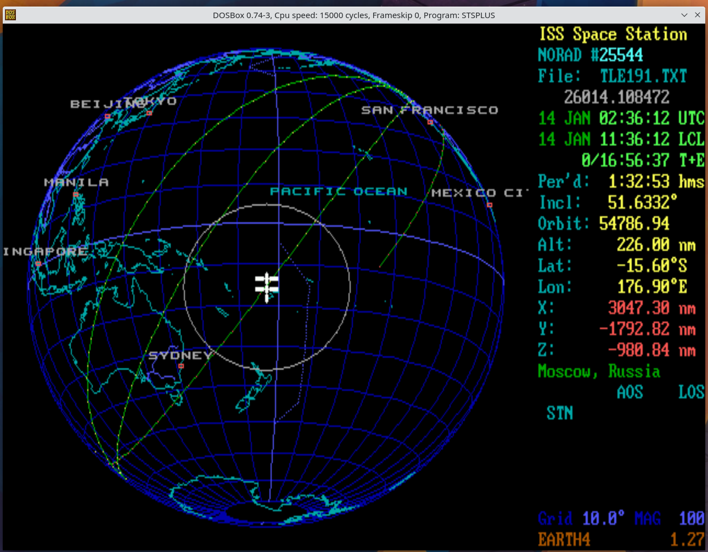
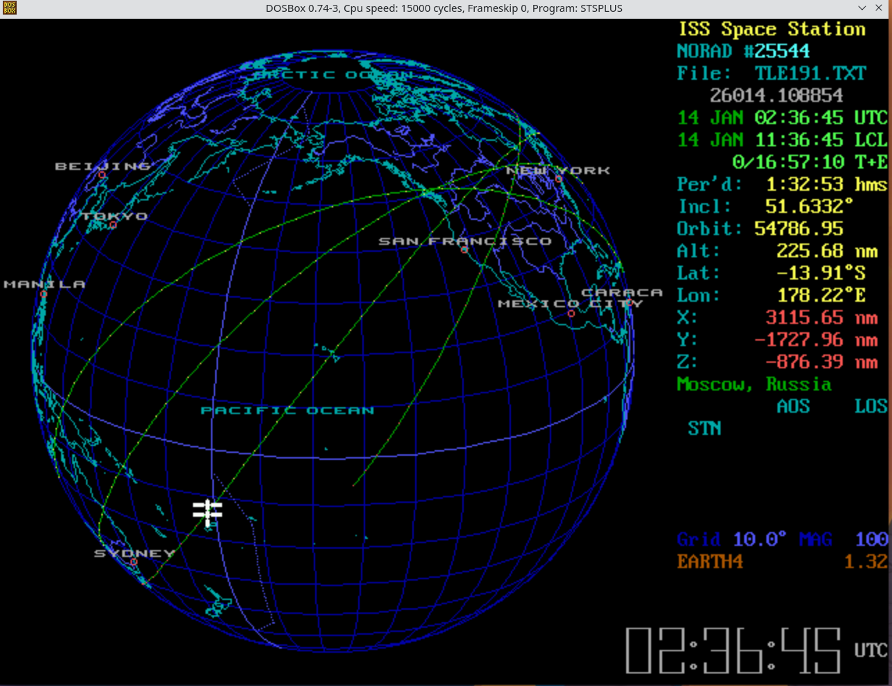
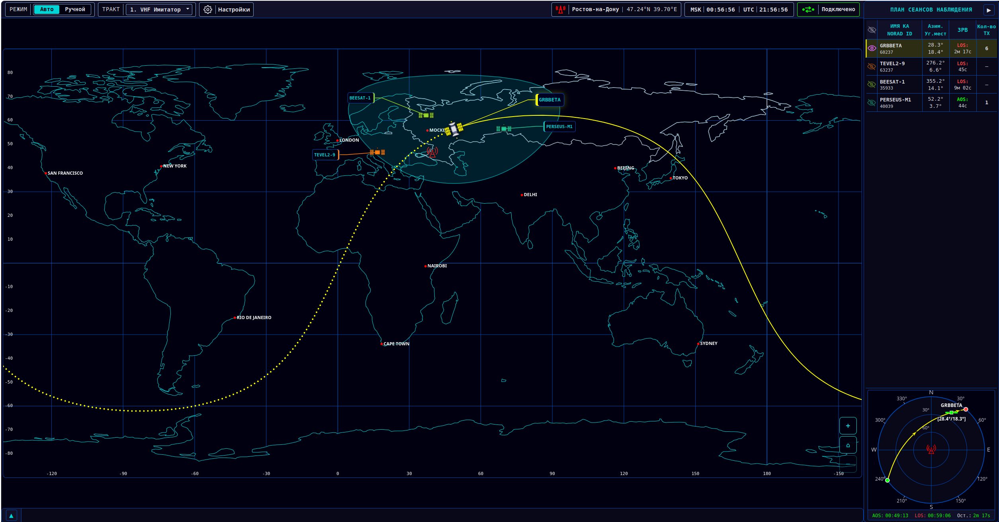

# 🛰️ Satellite Scout

Satellite Scout — это кроссплатформенное веб-приложение для отслеживания спутников (прежде всего CubeSat) в реальном времени.

ПО рассчитывает и отображает орбиты космических аппаратов на карте мира, проекции небесной сферы, выводит информацию по спутникам, а так же предоставляет возможность работать с радиоэфиром. 
Предусмотрено 2 режима работы: "Авто" и "Ручной".

Прием телеметрии через RTL-SDR приемник и демодуляции ТМИ сейчас на стадии разработки.


*Главное окно Satellite Scout: карта мира с траекториями орбит спутников*


*Страница "ручного" режима работ.*

## Предыстория

В одной из статей на Хабре про [ретро-компьютеры](https://habr.com/ru/articles/846270/) я наткнулся на скриншот DOS-программы **STSPLUS** (STSORBIT PLUS) — трекера спутников, написанного **David H. Ransom, Jr.**
Программа рассчитывала и рисовала орбиты космических аппаратов. Её использовали в NASA и даже в центре подготовки космонавтов в Звездном городке.

Я загорелся запустить STSPLUS на своём компьютере и посмотреть этот тёплый ламповый интерфейс вживую.

Мне пришлось перебрать несколько версий программы и несколько эмуляторов, разобраться с зависаниями при отрисовке карты и орбит.
И вот успешный успех после нескольких часов мучений:

<table>
<tr>
<td></td>
<td></td>
<td></td>
</tr>
<tr>
<td><em>STSPLUS — классическая плоская карта с орбитами МКС</em></td>
<td><em>STSPLUS — ортографическая проекция (глобус), отслеживание МКС</em></td>
<td><em>STSPLUS — ортографическая проекция (глобус), отслеживание МКС</em></td>
</tr>
</table>

Автор программы, к сожалению, [умер в 2006 году](https://celestrak.org/software/dransom/stsplus.html). Исходный код STSPLUS так и не был опубликован.

Я решил создать современную версию этой программы с расширенным функционалом.


*Главное окно Satellite Scout c темой STSPLUS*

## Что сейчас умеет Satellite Scout

- **Карта мира** — наземная трасса орбиты, зона видимости, увеличение карты, положение спутника обновляется в реальном времени.
- **Небесная сфера (Sky View)** — траектория пролёта на азимутальной проекции неба.
- **План сеансов** — какие спутники сейчас видны, расписание пролётов на ближайшее время (появление, максимум, исчезновение); можно выбрать спутник для сопровождения.
- **Режим «Авто»** — общий обзор эфира: вывод информации по передатчикам каждого спутника.
- **Режим «Ручной»** — инструменты для ручной работы с эфиром: панорама диапазонов, спектр и водопад, демодулятор, телеметрия, азимут и угол места антенны.
- **Настройки** — координаты наблюдателя, отслеживаемые группы спутников, параметры приёмного тракта, темы оформления интерфейса.
- **Список исключений** — скрыть ненужные спутники из плана и таблиц.

## Технологии

| Слой | Технологии |
|------|-----------|
| **Backend** | Go 1.25+, REST API, SSE, Go templates, `embed.FS`, конфиг JSON |
| **Frontend** | HTMX (формы/таблицы), Vanilla JS, Canvas 2D, CSS Grid |
| **Данные** | TLE (Celestrak), SGP4, WGS84, SatNOGS Transmitters API |
| **Real-time** | SSE — позиции, группа, смена темы |
| **SDR (planned)** | HTTP Chunked Stream — FFT, PCM (см. ADR-002) |

Вся математика выполняется на сервере (Go), фронтенд только рисует.

### Хранение в браузере

При смене темы в интерфейсе приложение сохраняет выбор **только на стороне клиента** и не использует это для рекламы или аналитики:

| Механизм | Ключ | Назначение |
|----------|------|------------|
| **Cookie** | `ss-theme` | Тема оформления при первой отрисовке страницы |
| **localStorage** | `ss-ui-theme`, `ux.mainMode`, `ux.radioPath` | Тема, режим Авто/Ручной, выбранный радиотракт |

Эти значения не являются персональными данными и не идентифицируют пользователя; это лишь запоминание настройки «какой CSS подключить».

## Архитектура

```text
┌────────────────────────────────────────────────────────┐
│                      Browser                           │
│  ┌──────────┐ ┌──────────┐ ┌────────┐ ┌─────────────┐  │
│  │ Earth    │ │ Sky View │ │ Az/El  │ │ План        │  │
│  │ View     │ │          │ │ Gauges │ │ сеансов     │  │
│  └─────┬────┘ └─────┬────┘ └───┬────┘ └──────┬──────┘  │
│        └────────────┼──────────┼─────────────┘         │
│              SSE Client + StateManager                 │
└──────────────────────▲─────────────────────────────────┘
                       │ SSE
┌──────────────────────┴─────────────────────────────────┐
│                     Go Server                          │
│              ┌─────────────────────┐                   │
│              │      SSE Hub        │                   │
│              └───▲─────────────▲───┘                   │
│                  │             │                       │
│          ┌───────┘             └─────────┐             │
│          │                               │             │
│  ┌───────┴──────┐              ┌─────────┴──────────┐  │
│  │  Position    │              │   Pass Service     │  │
│  │  Service     │              │ (predict AOS/LOS)  │  │
│  └───────▲──────┘              └─────────▲──────────┘  │
│          └──────────┬────────────────────┘             │
│             ┌───────┴──────────────────────┐           │
│             │ SGP4 + Coordinates + TLEStore│           │
│             └──────────────▲───────────────┘           │
│                            │                           │
│                     ┌──────┴──────┐                    │
│                     │  Celestrak  │                    │
│                     │  TLE Data   │                    │
│                     └─────────────┘                    │
└────────────────────────────────────────────────────────┘
```

## Запуск

### Локально (Go)

```bash
git clone https://github.com/art-injener/satellite-scout.git
cd satellite-scout

make build
make run

# http://localhost:8080/tracking
```

`DEV_MODE=true` (по умолчанию) — шаблоны и статика с диска, без пересборки.

При первом запуске, если файла ещё нет, приложение создаёт `data/config.json` с дефолтами. Дальше все настройки — в этом файле или через UI **Настройки**.

### Конфигурация (`data/config.json`)

Единый файл настроек: порт HTTP, тема, TLE, SatNOGS, координаты наблюдателя, радиотракты. Переменные `PORT`, `OBSERVER_*` и прочие из старых инструкций **не используются**, если файл уже существует — только однократный bootstrap при первом старте без файла.

Минимальный пример (станция «basic» — только карта и план сеансов, без SDR):

```json
{
  "_version": 1,
  "server": { "port": "8080" },
  "ui": { "theme": "default", "show_all_tracks_on_start": false },
  "tle": {
    "cache_dir": "data/tle_cache",
    "groups": ["stations", "amateur", "cubesat"],
    "update_interval": "6h",
    "max_tle_age_days": 7
  },
  "satnogs": {
    "enabled": true,
    "cache_ttl": "24h",
    "timeout": "12s",
    "max_retries": 2,
    "workers": 4
  },
  "exclude_norad_file": "data/tle_cache/exclude_norad.txt",
  "station": {
    "name": "Моя станция",
    "observer": {
      "name": "Город",
      "lat": 55.7558,
      "lon": 37.6173,
      "alt_m": 150
    },
    "radio_paths": []
  }
}
```

Пустой `radio_paths` — режимы «Авто»/«Ручной» в UI скрыты. Радиотракты добавляются через **Настройки** или вручную в JSON (с перезапуском).

Кеш TLE и список исключённых NORAD ID лежат рядом: `data/tle_cache/`.

### Docker Compose

```bash
make docker-build    # собрать образ
make docker-up       # запустить в фоне
make docker-logs     # логи
make docker-down     # остановить
```

Приложение: [http://localhost:8080/tracking](http://localhost:8080/tracking)

Каталог `./data` монтируется в контейнер — там же `config.json`, кеш TLE и `exclude_norad.txt`. При первом запуске с пустой папкой `data/` конфиг создаётся автоматически.

Переопределить путь к конфигу или режим embed/диск (необязательно):

```bash
cp .env.example .env   # опционально
make docker-up
```

| Переменная | По умолчанию | Описание |
|------------|-------------|----------|
| `SS_CONFIG` | `data/config.json` (локально) / `/app/data/config.json` (Docker) | Путь к файлу конфигурации |
| `DEV_MODE` | `true` локально, `false` в Docker | `true` — шаблоны/статика с диска; `false` — embed (production) |

Порт, координаты, тема и TLE — **только в `config.json`**, не в `.env`.


## Статус разработки

```text
Общий прогресс: ███████████████░░░░░ 72% (~58/80 задач)
```

| Фаза | Статус | Описание |
|------|--------|----------|
| **PHASE-1** | ✅ 80% | TLE — загрузка с Celestrak, парсинг, кеш, SGP4 (остался TLE-006) |
| **PHASE-2** | 🔄 75% | Координаты — ECI→ECEF→LLA→AER, `range_rate` в SSE (COORD-002 частично) |
| **PHASE-3** | ✅ 100% | Предсказание пролётов — AOS/TCA/LOS, PassService, reference-тесты skyfield |
| **PHASE-4** | ✅ 100% | Наземная трасса — орбита на карте, зона видимости |
| **PHASE-5** | ✅ 100% | Real-time — SSE (позиции, группа, tracks, SatNOGS freq/mod) |
| **PHASE-6** | ✅ 100% | Интерфейс — карта, SkyView, план сеансов, настройки, темы |
| **PHASE-6B** | ✅ 100% | Индикаторы Az/El, NORAD ID, стрелка спутника |
| **PHASE-6C** | ✅ 100% | Строка состояния — SSE, время, станция в footer |
| **PHASE-6D** | ✅ 100% | Информационная панель — данные через SSE, «Сопровождение» |
| **PHASE-UX-4** | 🔄 57% | Режимы Авто/Ручной (ADR-004) — toggle, CSS панелей, hotkeys |
| **PHASE-7** | ✅ 100% | Масштабирование карты — zoom, callouts |
| **PHASE-7B** | ⏳ 0% | 3D глобус — режим сферы как в STSPLUS |
| **PHASE-8** | ⏳ 0% | Поворотная платформа — rotctld, REST, UI сопровождения |
| **PHASE-9** | 🔄 71% | Конфигурация — `config.json`, settings, SatNOGS (TX-DB pending) |
| **PHASE-10** | 🔄 25% | Тестирование — E2E, reference, SSE-тесты |
| **PHASE-11** | ⏳ 0% | RTL-SDR — FFT, waterfall, Doppler, Chunked Stream (ADR-002) |
| **PHASE-12** | ⏳ 0% | Демодуляция ТМИ — FSK/AFSK, AX.25, телеметрия в UI |
| **PHASE-13** | 🔄 80% | UI «Авто» |
| **PHASE-14** | 🔄 83% | UI «Ручной» |

**Легенда:** ✅ Реализовано | 🔄 В работе | ⏳ Запланировано

Подробный журнал: [`memory-bank/progress.md`](memory-bank/progress.md).

## Документация

Архитектурные решения — [`docs/ADR/`](docs/ADR/).

История изменений интерфейса — [`docs/ui-changelog.md`](docs/ui-changelog.md).

## Ссылки

- **[STSPLUS](https://celestrak.org/software/dransom/stsplus.html)** — DOS-трекер спутников (David H. Ransom, Jr.)
- **[Celestrak](https://celestrak.org)** — TLE-данные (T.S. Kelso)
- **[SatNOGS DB](https://db.satnogs.org/)** — каталог передатчиков любительских спутников

## Лицензия

**GPL-3.0-or-later** (см. [`LICENSE`](LICENSE)).
