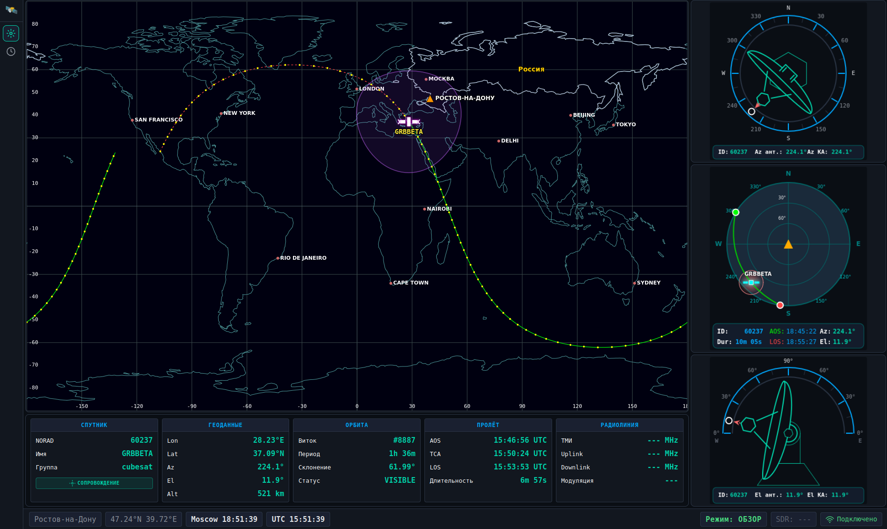
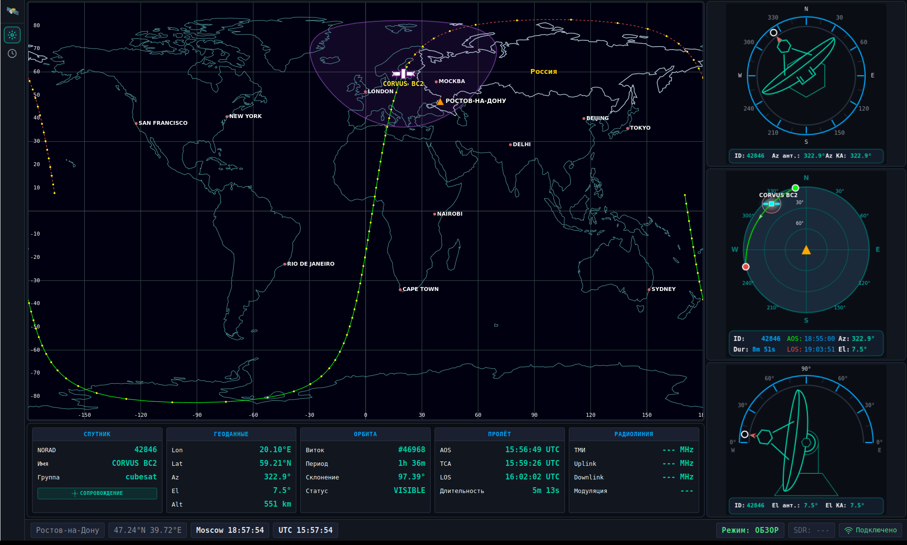

# Satellite Scout

Кроссплатформенное приложение для отслеживания спутников и SDR приёма/демодуляции сигналов.

## Демонстрация интерфейса

### Скриншоты

  
*Общий вид интерфейса Satellite Scout с картой мира, индикаторами азимута и угла места, азимутальной проекцией неба и информационной панелью со всеми параметрами спутника.*

### Анимация

  
*Анимация работы всех компонентов интерфейса: отображение орбиты спутника на карте, обновление индикаторов в реальном времени, анимация движения спутника и взаимодействие с различными элементами UI.*

## Технологии

**Backend:**

- Go
- REST API + SSE (Server-Sent Events)
- Go templates

**Frontend:**

- HTMX — динамические UI компоненты
- Vanilla JS + Canvas — визуализации (карта, индикаторы)
- CSS Grid — адаптивная вёрстка

## Запуск

```bash
# Сборка
make build

# Запуск
make run

# Открыть в браузере
# http://localhost:8080
```

## Ключевой функционал

### Backend

- ✅ **Загрузка TLE** — TLEStore, автоматическая загрузка с Celestrak, кеш
- ✅ **SGP4 пропагация** — расчёт позиций с точностью ±0.01°
- ✅ **Координаты** — ECI→ECEF→LLA→AER (WGS84)
- ✅ **Pass Predictor** — AOS/TCA/LOS, SkyPath (X/Y), номер орбиты; валидация ±30 сек
- ✅ **Наземная трасса и зона видимости** — GroundTrack, VisibilityZone (72 точки)
- ✅ **PassService + API** — GET `/api/passes`, POST `/api/tracking/current`, кеш 5 мин
- ✅ **SSE Real-time** — Hub, позиции 1/сек, трек 30/сек, зона видимости в событии
- ⏳ **Освещённость** — Sunlit/Penumbra/Umbra (backlog)


### Frontend

- ✅ **Earth View** — карта мира, орбита, наземная трасса, зона видимости (данные по SSE)
- ✅ **Sky View** — азимутальная проекция неба, позиция спутника
- ✅ **Индикаторы** — азимут и угол места в реальном времени
- ✅ **SSE Client** — подключение к `/api/sse`, автопереподключение, SatelliteStateManager
- ✅ **Вкладка «Пролёты»** — маршрут `/passes`, страница с таблицей
- 🔄 **Таблица пролётов** — загрузка из API, SVG мини-проекция, обратный отсчёт, статусы (active/upcoming/completed), автообновление 60 сек;
- ⏳ **Автопереключение спутников** — после LOS (PASS-004)

### Имитатор (для TDD)

- ⏳ **TLE Generator** — генерация TLE из параметров орбиты
- ⏳ **FSK модулятор** — модуляция телеметрии
- ⏳ **SDR симулятор** — имитация приёма с шумом и Doppler
- ⏳ **FSK демодулятор** — декодирование телеметрии

**Легенда:** ✅ Завершено | 🔄 В работе | ⏳ Запланировано

### Прогресс по фазам

| Фаза | Статус | Прогресс | Описание |
|------|--------|----------|----------|
| **PHASE-1** | 🔄 | 80% (4/5) | TLE парсер, Celestrak, TLEStore, SGP4 — осталось: модуль констант |
| **PHASE-2** | 🔄 | 50% (1/2) | Координаты ECI/ECEF/LLA/AER — осталось: Range Rate (Doppler) |
| **PHASE-3** | 🔄 | 20% (1/5) | PassPredictor — осталось: фильтрация, группировка, ActiveSatelliteManager |
| **PHASE-4** | ✅ | 100% (2/2) | Наземная трасса, зона видимости |
| **PHASE-5** | 🔄 | 75% (3/4) | SSE Hub, Position, Track — осталось: Event Notifications |
| **PHASE-6** | 🔄 | 63% (5/8) | StateManager, SSE Client, UI, PassService, вкладка Пролёты, TrackingManager |
| **PHASE-7** | ⏳ | 0% (0/4) | Конфигурация, config.yaml, ошибки, логирование |
| **PHASE-8** | ⏳ | 0% (0/5) | Тесты, эталонные TLE, валидация Heavens-Above |

## Статус разработки

```
Общий прогресс: ██████████░░░░░░░░░░ 46% (16/35 задач)

✅ PHASE-1: Парсер TLE, Celestrak, TLEStore, SGP4
✅ PHASE-2: Координаты ECI→ECEF→LLA→AER
✅ PHASE-3: PassPredictor (AOS/TCA/LOS, SkyPath, OrbitNumber)
✅ PHASE-4: Наземная трасса, зона видимости
✅ PHASE-5: SSE Hub, Position Service, Track Service
✅ PHASE-6: StateManager, SSE Client, рефакторинг UI, PassService, вкладка «Пролёты»
🔄 Таблица пролётов
⏳ Конфигурация (YAML/ENV), тесты, освещённость, автопереключение спутников
```

## Лицензия

MIT
